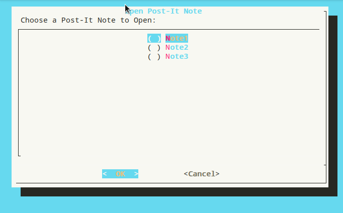

# TerminalPostItNotes
A linux bash script that functions as three editable 'post it note' windows

## Info:
 

## Installation
1) Clone this repo or (Recommended) Download the .zip file:
$ wget https://github.com/Buscedv/TerminalPostItNotes/TerminalPost-It.zip
2) Extract the files
3) Open a terminal and type the following (under usage)

## Usage

$ sh postit.sh

## License

GNU GPL v.3

## Contact

Github: @buscedv
Email: edvard1807@gmail.com
